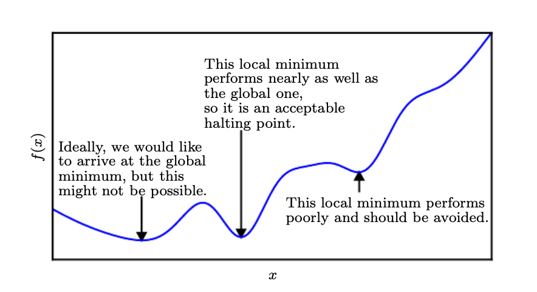

# Numerical Computation

Machine learning algorithms often require a lot of numerical computation. Algorithms solve mathematical problems by methods that iteratively update estimates of the solution. Common optimizations include finding the value of an argument that minimizes or maximizes a function.

> Even just evaluating a mathematical function on a digital computer can be difficult when the function involves real numbers, which cannot be represented precisely using a finite amount of memory.

## 4.1 Overflow and Underflow

The fundamental difficulty of computing continuous math is the need to represent many real numbers infinitely with a finite number of [bit patterns](https://encyclopedia2.thefreedictionary.com/bit+pattern). Naturally, we incur some approximation error when representing numbers in a computer. For example, compounding errors can occur when an algorithm is not designed to minimize the accumulation of rounding error.

One problematic example is **underflow** which occurs when numbers near zero are rounded to zero. This should be avoided for various reasons. For example, many computational environments will raise an error when attempting division by zero.

Another damaging form of error is **overflow**. Overflow occurs when numbers with large magnitude are approximated to infinity or negative infinity.

One function that should be stabilized against underflow and overflow is the **softmax function**. Softmax is often used to predict probabilities associated with multinoulli distribution.

Difficulties with overflow and underflow can be resolved by adding or subtracting a scalar from the input vector.

> Subtracting max-sub-i x-sub-i results in the largest argument to exp being 0, which rules out the possibility of overflow. Likewise, at least one term in the denominator has a value of 1, which rules out the possibility of underflow in the denominator leading to a division by zero.

The problem of underflow in the numerator can be solved similarly implementing a function that calculates log softmax in a numerically stable way.

See [Theano](http://deeplearning.net/software/theano/) provides examples of auto-detection and stabilization of commonly unstable expressions.

## 4.2 Poor Conditioning

Conditioning is a reference to how rapidly a function changes when there are small changes to its input. Functions that are sensitive to small changes in input can be problematic when rounding errors in the input result in large changes in output. Matrix inversion is particularly sensitive to error in the input.

> This sensitivity is an intrinsic property of the matrix itself, not the result of rounding error during matrix inversion. Poorly conditioned matrices amplify pre-existing errors when we multiply by the true matrix inverse. In practice, the error will be compounded further by numerical errors in the inversion process itself.

## 4.3 Gradient-Based Optimization

Most deep learning algorithms will require optimization of some kind.

> Optimization refers to the task of either minimizing or maximizing some function f(x) by altering x. We usually phrase most optimization problems in terms of minimizing f(x). Maximization may be accomplished via a minimization algorithm by minimizing −f (x).

A brief review of how calculus concepts relate to optimization:

> Suppose we have a function y = f(x), where both x and y are real numbers.
The **derivative** of this function is denoted as f(x) or as dx. The derivative f(x) gives the slope of f(x) at the point x. In other words, it specifies how to scale a small change in the input in order to obtain the corresponding change in the output

The derivative is useful for minimization because it tells us how to change x in order to make a small improvement in y.

> We can thus reduce f (x) by moving x in small steps with opposite sign of the derivative. This technique is called **gradient descent** (Cauchy, 1847)

When the derivative provides no information about which direction to move. Points where f(x) = 0 are known as **critical points** or **stationary points**.

> A **local minimum** is a point where f (x) is lower than at all neighboring points, so it is no longer possible to decrease f(x) by making infinitesimal steps.
A **local maximum** is a point where f (x) is higher than at all neighboring points, so it is not possible to increase f(x) by making infinitesimal steps.

Some critical points are neither maxima or minima and are known as **saddle points**.

## 4.4 Constrained Optimization

## 4.5 Example: Linear Least Squares
