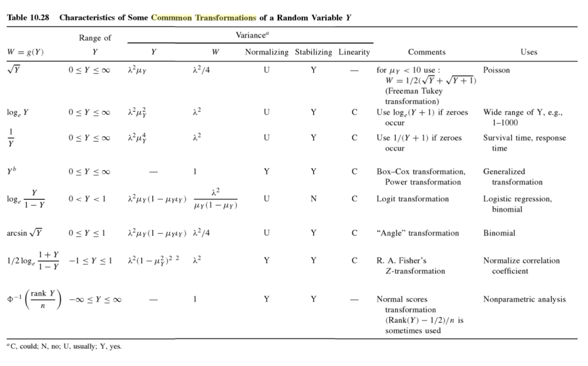

# Data screening and transformations

This chapter discusses applying transformations to obtain more normal distributions.

## 4.2 Common transformations

To examine common transformations, we can examine a plot of X against its transformed self. For example, a plot of logX versus X.

**Logarithm (log) to the base 10**

> Recall that logarithm is number that satisfies the relationship X=10<sup>y</sup>. That is, the logarithm of X is the power Y to which 10 must be raised to produce X.

If X can have zero or negative values, an appropriate constant may be applied.

Remember that Logarithms can be taken to any base. When taken to the familiar base `e=2.7183`, they can be called **natural logarithms**.

> The natural logarithm is used frequently in theoretical studies because of certain appealing mathematical properties.

**Power transformations (p value)**

> ...the transformation X<sup>2</sup> (X raised to the power of 2) is used frequently in statistical formulas such as computing variance

The most commonly used are X raised to the power of ½ and the inverse X raised to the power of -1

Transformations are characterized by noting the power to which X is raised using the symbol `p`.

|Square Root| Inverse | Logarithmic |
|---|---|---
p = ½ | p = -1 | p = 0

The effects of these transformations in reducing long-tailed distribution to the right are greater as the value `p` decreases from 1.

**Exponential function**

> An exponential function of X may thought of as the antilogarithm of X

The function 10<sup>x</sup> has the same shape but increases faster than e<sup>x</sup>. See figure 4.3

## 4.3 Selecting appropriate transformations

The most common distribution for continuous observation is typically referred to as **Gaussian** (or normal) distribution.

**Assessing normality using histograms**

Most often, a histogram with normal distribution will resemble a bell-shaped Gaussian curve. The right side of the mean will mirror the left. See 4.4a

**Assessing normality using box plots**

Symmetry of the empirical distribution can be assessed by examining quantiles. Quantiles are obtained by first order N observations from smallest to largest. The ordered observations are used to compute the quantile using the formula:

```
Q(i) = (i - 0.5)/N
```

Percentiles are similar but are  computed dividing the sample into 100 equal parts.

Widely used quantiles include the sample median Q(0.5). Theoretically, for the normal distributions, the median equals the mean or are not very different. **Quartiles** Q(0.25) and Q(0.75) are also widely used.

> If the distribution is symmetric, then the difference between the median and Q(0.25) would equal the difference between Q(0.75) and the median. This is displayed graphically in **box plots**.

Q(0.75) and Q(0.25) are plotted at the top and bottom of the box and the median is denoted by either a line or dot within the box. The Lines is this case are called **whiskers** and extend from the ends of the box out the what are called **adjacent values**. Values that are are beyond the adjacent value are sometimes defined as outliers. Visual symmetry (when looking at distances from the median) most often denotes normal distribution.

**Assesing normality using normal probability or normal quantile plots**

> Normal probability plots present and appealing option for checking for normality.

This graph is a plot of the **cumulative distribution** found in the data set. If the data were from a normal distribution, the normal probability plot should approximate a straight line. See 4.4a. Although, even when the data are normally distributed, the plot may not be perfectly straight when a sample size is small. In this case, the middle 80 or 90% of the graph should approximate a straight line.

One example where a transformation can be applied is visible in figure 4.4c. Distribution is skewed to the right (longer tail on the right side). In this case we can create a new variable by taking the logarithm of X to base 10 or *e*.

Quantile-quantile plots called **normal quantile plots** represent theoretical (normal) distribution against the empirical quantiles of the data.

**Selecting a transformation to induce normality**

As noted, transformed data can sometimes approximate normal distribution. In some cases transformation is known. For example, the square root transformation is used with Poisson-distributed variables. The logarithmic transformation is often used when variables present long tails to the right.

Common transformations included in [Fisher and van Belle (1993)](https://books.google.com/books?hl=en&lr=&id=KSh8IOrLPzwC&oi=fnd&pg=PR7&ots=K5afJEhYII&sig=6Dv50xjemqIdd6e0hlr-1cO11-g#v=onepage&q=common%20transformations&f=false).



Another strategy for choosing a transformation is to progress up or down the values of `p` depending on the shape of the normal probability plot.

> If the plot looks like Figure 4.2c, then a value of `p` less than 1 is tried. Suppose `p = ½` is tried. If this is not sufficient and the normal probability plot is still curved downward at the ends, then `p = 0`, i.e., the logarithmic transformation, can be tried. If the plot appears to be a little too much, a positive constant can be added. Thus various transformations of the form `(X + C)`<sup>`p`</sup> are tried until the normal probability plot is as straight as possible.

An investigator can decrease or increase the value of *p* until reaching a normal distribution. However, this does not mean that theoretically your sample will have normal distribution. Particularly if the sample is small, the transformation applied to a sample may not be best for the entire population.

The Hines and O'Hara Hines (1987) method was developed to reduce the number of iterations needed by providing a graph which produces a suggested value for *p*.

Their method uses quantiles and suggests that, if the data are normally distributed, the difference between the median and a lower quantile should equal the difference between the upper symmetric quantile and the median.

> By choosing a transformation that results in those differences being equal, one is choosing a transformation that tends to make the data approximately normally distributed.

**Statistical tests for normality**

A formal test of normality can be done to determine if a null hypothesis of normal distribution is rejected and whether a transformation should be considered. A common procedure is the Shapiro-Wilk W statistic.

Another way of testing for normality is to examine the **skewness** of data.

> **Skewness** is a measure of how nonsymmetric a distribution is. If the data are symmetrically or normally distributed, the computed skewness to its standard error can be compared with normal Z tables, and symmetry, and hence normality would be rejected if the absolute value of the ratio is large.

Distribution with a long tail to the right indicates positive skewness. Note that a skewness test should be performed only after outliers or erroneous observations are removed.

**Assessing the need for transformation**

Typically, if the standard deviation of the untransformed variable divided by the mean is less than ¼, then a transformation may not be necessary.

> Alternatively, if the largest observation divided by the smallest observation is less than 2, then the data are likely not to be sufficiently variable for the transformation to have a decisive effect on the results (Hoaglin, Mosteller and Tukey, 1983)

An examination of of how far the normal probability plot is from a straight line can also be a good indicator of whether a transformation is needed. A slightly curved line, for example, may indicate that one should not bother with a transformation.

> Note that the usefulness of transformations is difficult to evaluate when the samples sizes are small or numerous outliers are present.

If transformations alter results, select the transformation that makes the data as conformant as possible to the assumptions.

> If a particular transformation is selected, then all analyses should be performed on the transformed data, and the results should be presented in terms of the transformed values.

## 4.4 Assessing independence

Two or more variables collected from the **same** individual are not expected to be independent of each other. On the other hand, it is safe to assume that observations collected from **different** individuals are independent.
